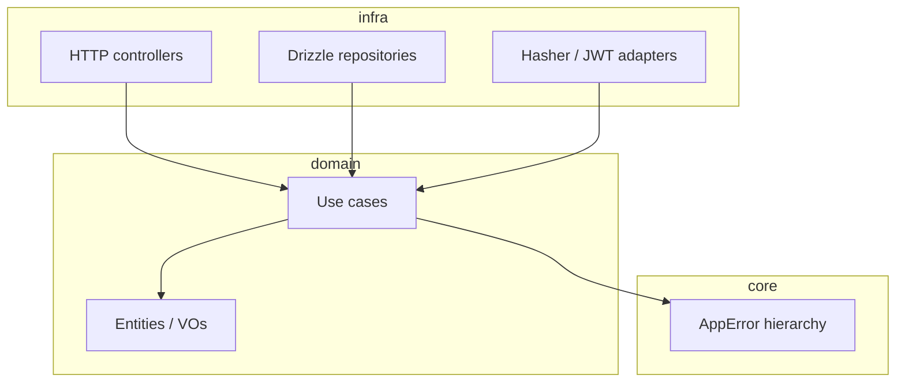

# bun-ddd-api-template

Opinionated **[Bun](https://bun.sh/)** + **TypeScript** API skeleton using **Domain-Driven Design** (bounded contexts, `Either` use cases, ports/adapters) and a production-shaped **infra** layer (**Elysia**, **Drizzle/Postgres**, **JWT**). Use it as a base for new HTTP services when you want clear boundaries and colocated tests—not a minimal “hello world.”

**Shipped reference domain:** **`identity`** (accounts, password hashing, `POST /accounts`, `POST /sessions` with access JWT + refresh cookie). Extend it and add sibling folders under `src/domain/` for other product areas.

---

## Table of contents

- [Who this is for](#who-this-is-for)
- [What you get](#what-you-get)
- [Tech stack](#tech-stack)
- [Architecture (high level)](#architecture-high-level)
- [Project structure](#project-structure)
- [Quick start](#quick-start)
- [Environment variables](#environment-variables)
- [Scripts](#scripts)
- [API surface](#api-surface)
- [Working with bounded contexts](#working-with-bounded-contexts)
- [Tests & CI](#tests--ci)
- [Contributing](#contributing)
- [Documentation](#documentation)
- [License note](#license-note)

## Who this is for

Teams or solo devs who want:

- **Stable layering:** `infra → domain → core` with explicit imports (see [`src/CLAUDE.md`](src/CLAUDE.md)).
- **A working vertical slice:** HTTP + validation + use case + repository + DB + auth-related patterns.
- **Agent- and human-friendly docs:** layered **`CLAUDE.md`** files plus [`docs/archiqueture/`](docs/archiqueture/README.md).

## What you get

- **DDD layout** by bounded context under `src/domain/<context>/` (`enterprise/` + `application/`).
- **Application errors** aligned with HTTP via [`src/core/errors`](src/core/errors) and **archstone** `Either` use cases.
- **Infra:** Elysia app, OpenAPI at **`/docs`**, Drizzle repositories, typed **zod** env, Bun hasher + JWT encrypters for **identity** ports.
- **Tests:** `*.spec.ts` next to source; **`*.e2e-spec.ts`** with optional Postgres isolation ([`test/setup-e2e.ts`](test/setup-e2e.ts)).
- **Quality gate:** Ultracite (Biome) + Husky pre-commit (`bun test` + format/lint).

## Tech stack

| Layer | Choices |
|--------|---------|
| Runtime & tooling | Bun |
| HTTP | Elysia, `@elysiajs/openapi`, `@elysiajs/cors`, `@elysiajs/jwt`, `@elysiajs/bearer` |
| Domain primitives | [archstone](https://www.npmjs.com/package/archstone) |
| Persistence | Drizzle ORM + PostgreSQL |
| Config | zod (`src/infra/env`) |
| Lint / format | Ultracite + Biome |

## Architecture (high level)



- **Domain** has no imports from `infra`; **core** has no imports from `domain` or `infra`.
- **Identity** use cases depend on **ports** (`HashComparer`, `Encrypter`, `AccountRepository`); **infra** implements them.

## Project structure

```txt
src/
  core/              AppError + shared non-business primitives
  domain/
    identity/        reference BC: accounts, auth use cases, repo contract
  infra/
    app.ts           Elysia + OpenAPI + /health
    server.ts        listen()
    auth/            JWT bearer plugin (for protected routes)
    cryptography/    BunHasher, JWT encrypter (implements domain ports)
    env/             zod-validated process.env
    http/            controllers, factories, presenters, http.module
    database/        Drizzle client, schema, migrations, mappers, repos
test/
  factories/         make-*.factory.ts
  repositories/      in-memory-* (domain repo contracts)
  cryptography/      fakes for port tests
  setup-e2e.ts       isolated schema + apply migrations (e2e preload)
  run-e2e.ts         discover *.e2e-spec.ts
docs/
  archiqueture/      long-form architecture + onboarding (see index below)
```

Deeper rationale: [`docs/archiqueture/domain-structure.md`](docs/archiqueture/domain-structure.md).

## Quick start

```bash
bun install
cp .env.example .env
# Start Postgres (or point DATABASE_URL at your instance)
docker compose up -d
bun run db:migrate
bun run dev
```

- **Dev server:** `http://localhost:3333` (override with `PORT`).
- **OpenAPI UI:** `/docs`.
- **Health:** `HEAD /health`.

**Full setup** (troubleshooting, E2E, production run): [**Getting started**](docs/archiqueture/getting-started.md).

**Forking for a real product:** [**New API from this template**](docs/archiqueture/new-project-from-template.md).

## Environment variables

Validated in [`src/infra/env/index.ts`](src/infra/env/index.ts).

| Variable | Default | Notes |
|----------|---------|--------|
| `NODE_ENV` | `development` | `development` \| `production` \| `test` |
| `PORT` | `3333` | HTTP port |
| `DATABASE_URL` | _(required)_ | Postgres URL |
| `JWT_ACCESS_SECRET` | _(required)_ | Access token signing |
| `JWT_REFRESH_SECRET` | _(required)_ | Refresh token signing (different secret) |

See [Getting started — Environment](docs/archiqueture/getting-started.md#environment-variables) for `.env`, E2E env, and CI.

## Scripts

| Command | Purpose |
|---------|---------|
| `bun run dev` | Watch mode API (`src/infra/server.ts`) |
| `bun run build` | Bundle to `dist/server.js` |
| `bun run start` | Run production bundle |
| `bun test` | Unit + use-case specs (`*.spec.ts`) |
| `bun run test:e2e` | Integration specs (`*.e2e-spec.ts`; needs Postgres) |
| `bun run db:generate` | Drizzle: generate SQL from schema |
| `bun run db:migrate` | Drizzle: apply migrations |
| `bun run db:studio` | Drizzle Studio |
| `bun run check` | Ultracite check |
| `bun run fix` | Ultracite fix |

## API surface

Documented in OpenAPI (`/docs`). Reference implementation (identity):

| Method | Path | Notes |
|--------|------|--------|
| `POST` | `/accounts` | Register account (`name`, `username`, `email`, `password`, optional `slug`) |
| `POST` | `/sessions` | Email + password → `{ accessToken }` + httpOnly refresh cookie (`path: /auth/refresh`) |

Details, code map, and failure behavior: [`docs/archiqueture/identity-bounded-context.md`](docs/archiqueture/identity-bounded-context.md).

## Working with bounded contexts

1. Add a folder `src/domain/<your-context>/` with `enterprise/` and `application/` (mirror **`identity`** layout).
2. Add `src/domain/<your-context>/CLAUDE.md` when non-trivial rules accumulate; link it from [`src/domain/CLAUDE.md`](src/domain/CLAUDE.md).
3. Implement repository interfaces in `src/infra/database/…`; expose HTTP via `src/infra/http/` (controllers + factories).
4. Do **not** import one `src/domain/<a>/` context from another—coordinate through **infra** or future application services.

There is **no** generic `[bounded-context]/README.md` scaffold file; follow [`src/domain/CLAUDE.md`](src/domain/CLAUDE.md) and [`docs/archiqueture/domain-structure.md`](docs/archiqueture/domain-structure.md).

## Tests & CI

- **Unit / domain:** `bun test` picks up `*.spec.ts` next to sources. Use **`it("should …")`** for use cases and typical unit tests; **`*.vo.spec.ts`** uses **`test()`** without a `should` prefix on titles ([`test/CLAUDE.md`](test/CLAUDE.md)).
- **E2E:** `bun run test:e2e` uses `.env.test` + isolated DB schema; E2E files use **`test()`** ([`test/CLAUDE.md`](test/CLAUDE.md)).
- **GitHub Actions** (`.github/workflows/run-ci.yml`): runs on **pull requests** to `main` only (merge is allowed only after green checks, so a second run on `push` to `main` is redundant). Jobs: `check`, `bun test`, `test:e2e` with Postgres **17**, Bun install cache, `contents: read` permission.

## Contributing

For **this template** (and similar open-source setups), changes typically go through **PRs** into `main` with optional **protected `main`**. If you generated a **new repo from the template**, you can adopt a different Git workflow (e.g. direct pushes to `main`) and tune CI or branch rules—see [`CONTRIBUTING.md`](CONTRIBUTING.md) (“Your repo, your rules”). Security reports: [`SECURITY.md`](SECURITY.md).

## Documentation

| Resource | Description |
|----------|-------------|
| [`CONTRIBUTING.md`](CONTRIBUTING.md) | Optional OSS-style PR workflow; customizing Git/CI for template consumers |
| [`SECURITY.md`](SECURITY.md) | How to report security issues |
| [`docs/archiqueture/README.md`](docs/archiqueture/README.md) | Index of architecture docs |
| [`docs/archiqueture/getting-started.md`](docs/archiqueture/getting-started.md) | Env, Docker, migrations, OpenAPI, common issues |
| [`docs/archiqueture/new-project-from-template.md`](docs/archiqueture/new-project-from-template.md) | Checklist for new APIs from this repo |
| [`docs/archiqueture/domain-structure.md`](docs/archiqueture/domain-structure.md) | Bounded context strategy |
| [`docs/archiqueture/identity-bounded-context.md`](docs/archiqueture/identity-bounded-context.md) | Identity BC reference |
| [`CLAUDE.md`](CLAUDE.md) | Root conventions, commands, doc tier table |
| [`src/CLAUDE.md`](src/CLAUDE.md) | Layer rules, “where code goes,” reading order |

## License note

Add a `LICENSE` file when you publish a derived project; this template does not ship one by default.
